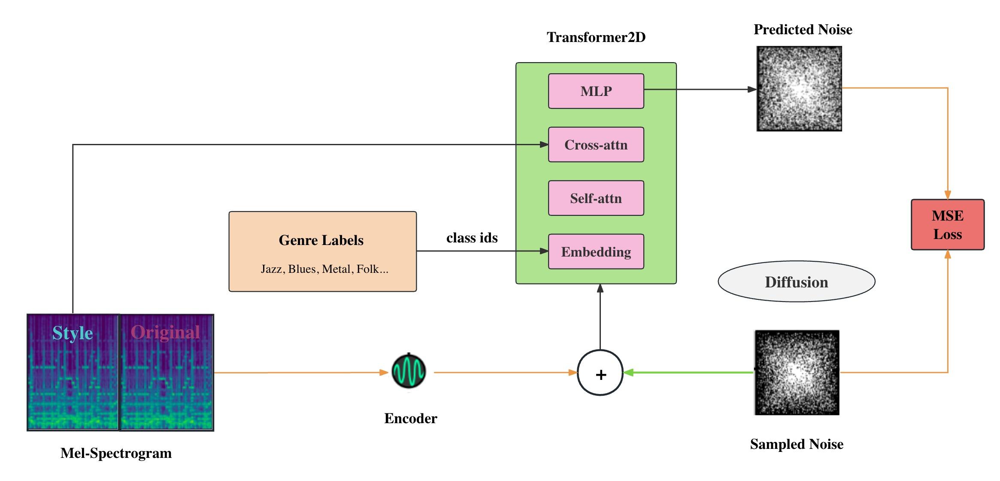
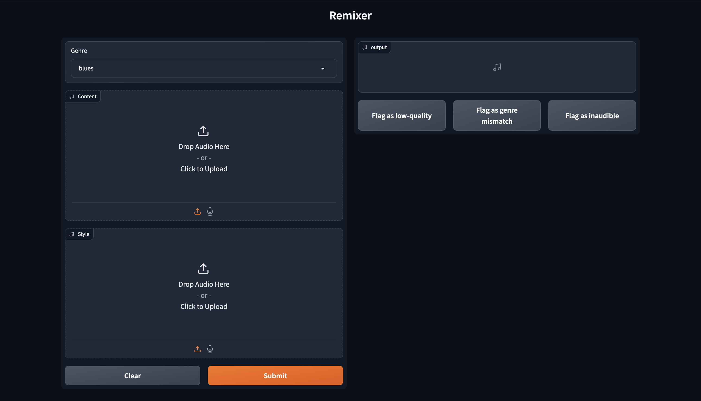

# Remixer



## Contents

- [Remixer](#Remixer)
    - [Contents](#contents)
    - [Description](#description)
    - [Model](#Model)
    - [Inference Pipeline](#Inference-Pipeline)
    - [Usage](#Usage)
    - [Production](#Production)

## Prerequisites

* Aws lambda from deploying
* Kubeflow and Accelerate for distributed training

## Description

A neural net that generates the audio from predefined genres.

## Model

The `remixer` model is inspired
by [Spectrogram Diffusion](https://huggingface.co/docs/diffusers/api/pipelines/spectrogram_diffusion), where
VQ-VAE is applied to capture the repetitive patterns in music, e.g. chord progression.

### Styled Music Generation

class_id of genre is provided to the transformer2D.

$$
L_{\text{reconstruction}} = \frac{1}{N} \sum_{i=1}^{N} \left\| x^{(i)} - \hat{x}^{(i)} \right\|^2

L_{\text{KL}} = D_{\text{KL}}(q(z|x) \parallel p(z)) = -\frac{1}{2} \sum_{j=1}^{J} \left(1 + \log((\sigma_j)^2) - (
\mu_j)^2 - (\sigma_j)^2\right)

L_{\text{VAE}} = L_{\text{reconstruction}} + \beta L_{\text{KL}}
$$

### Remixing

the encoded latents of `style` song are passed to the transformer2D as the guidance. The loss function is composed of
content loss, style loss and variation loss, inspired by NST:

$$
L_{\text{total}}(\vec{p}, \vec{a}, \vec{x}) = \alpha \cdot L_{\text{content}}(\vec{p}, \vec{x}) + \beta \cdot L_
{\text{style}}(\vec{a}, \vec{x}) + \gamma \cdot L_{\text{tv}}(\vec{x})
$$

## Inference Pipeline


#### Styled Music Generation:

Sample a Gaussian noise -> class label -> Diffusion -> Decode

#### Remix:

Encode the original and style audio -> pass to Transformer2D -> Diffusion -> Decode

## Usage

#### Styled Music Generation:

Simple select a pre-defined genre from the 'Genre' dropdown list.

#### Remix

Provide a `original` and `style` at the same time.

## Deploy

### Frontend



See [deploy.ipynb](./frontend/deploy.ipynb)

### Inference

To set up the server for inference, we create an AWS Lambda function for the backend:

```bash
python deploy/aws_lambda.py
```
